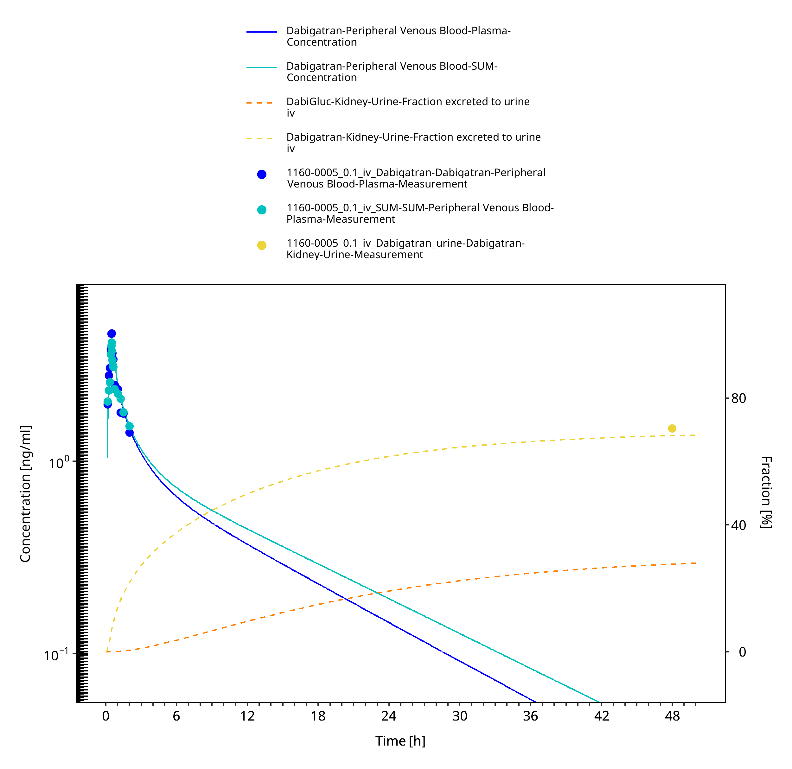
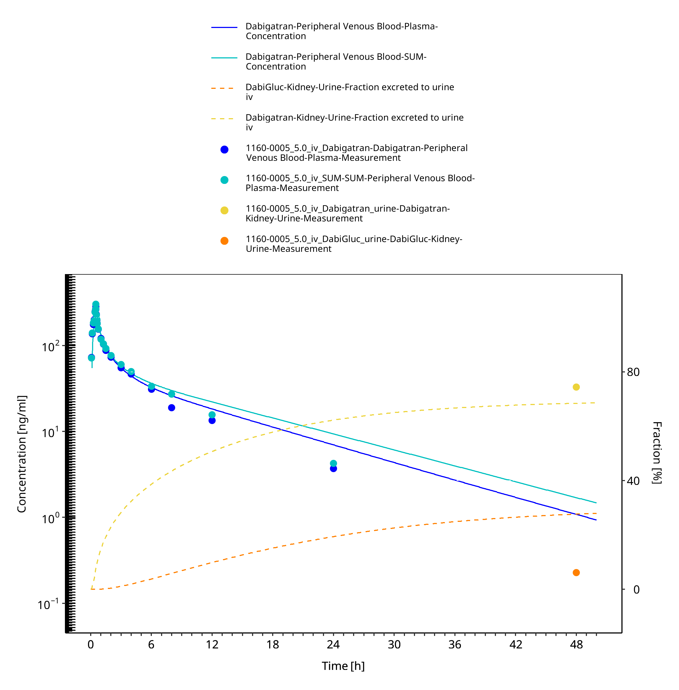

# Table of Contents

 * [1 Introduction](#intro)
 * [2 Methodsduction](#methods)
   * [2.1 Strategyduction](#strategy)
   * [2.2 Dataduction](#data)
   * [2.3 Assumptionsduction](#assumptions)
 * [3 Resultsduction](#results)
   * [3.1 Parametersduction](#parameters)
   * [3.2 Plotsduction](#plots)
   * [3.3 Profilesduction](#profiles)
     * [3.3.1 Trainingduction](#training)
     * [3.3.2 Testduction](#test)
 * [4 Conclusionduction](#conclusion)
 * [5 Referencesduction](#references)

# 1 Introduction

# 2 Methodsduction

## 2.1 Strategyduction

## 2.2 Dataduction

## 2.3 Assumptionsduction

# 3 Resultsduction

## 3.1 Parametersduction

## 3.2 Plotsduction

**Table 3-1: GMFE for Goodness of fit plot for concentration in plasma**

|Group                      |GMFE |
|:--------------------------|:----|
|Intravenous administration |1.16 |

 
 

**Figure 3-1: Goodness of fit plot for concentration in plasma**

 
 

**Figure 3-2: Goodness of fit plot for concentration in plasma**

 
 

**Figure 3-3: Analysis**

 
 

**Figure 3-4: Analysis**

 
 

## 3.3 Profilesduction

### 3.3.1 Trainingduction

**Figure 3-5: iv - 0.1 mg**

 
 

**Figure 3-6: iv - 5.0 mg**

 
 

**Figure 3-7: Analysis**

 
 

**Figure 3-8: Analysis**

 
 

### 3.3.2 Testduction

# 4 Conclusionduction

# 5 Referencesduction

