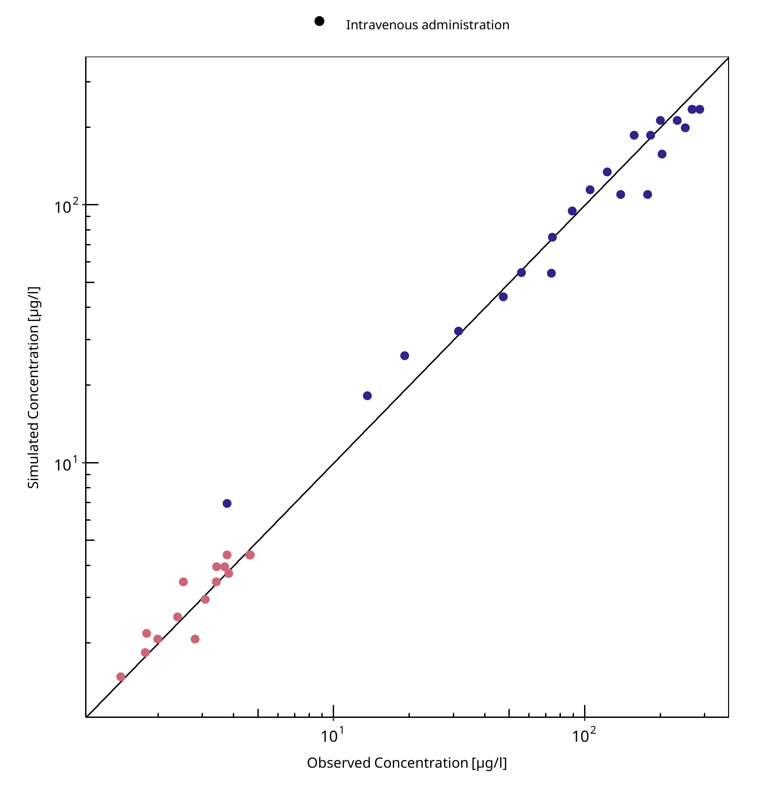
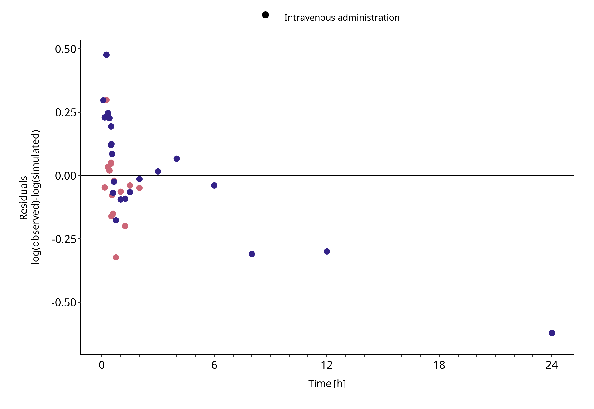
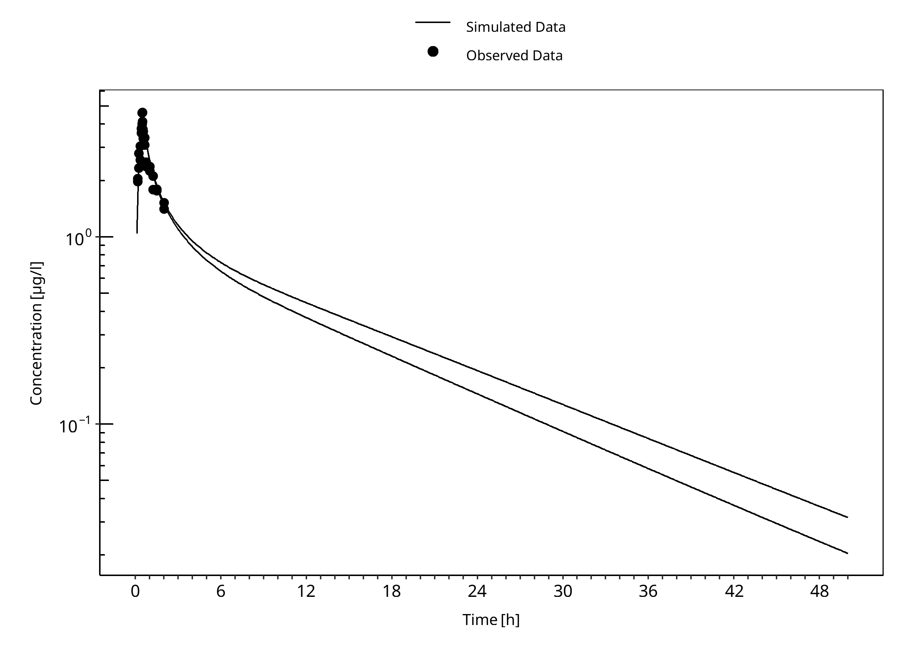
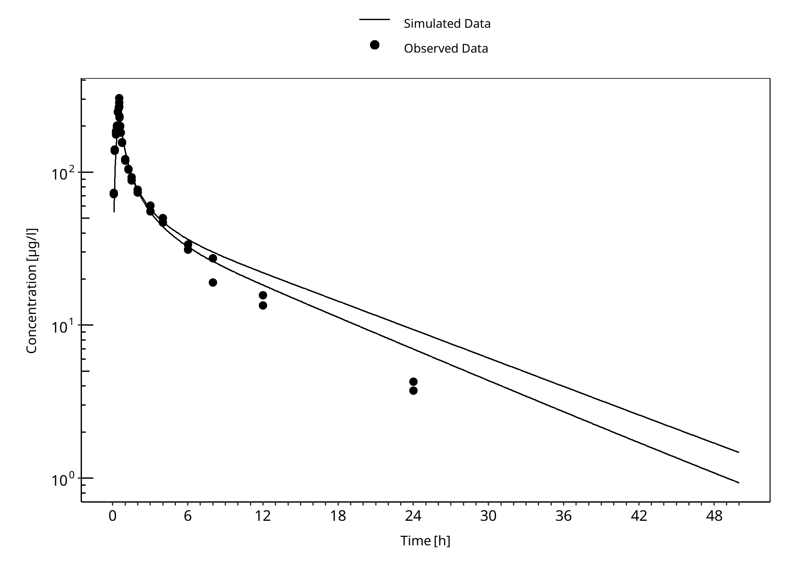

# Building and evaluation of a PBPK model for COMPOUND in healthy adults

| Version                                         | master-OSP12.2                                                   |
| ----------------------------------------------- | ------------------------------------------------------------ |
| based on *Model Snapshot* and *Evaluation Plan* | https://github.com/Open-Systems-Pharmacology/COMPOUND-Model/releases/tag/vmaster |
| OSP Version                                     | 12.2                                                          |
| Qualification Framework Version                 | 3.5                                                          |

This evaluation report and the corresponding PK-Sim project file are filed at:

https://github.com/Open-Systems-Pharmacology/OSP-PBPK-Model-Library/

# Table of Contents

 * [1 Introduction](#intro)
 * [2 Methodsduction](#methods)
   * [2.1 Strategyduction](#strategy)
   * [2.2 Dataduction](#data)
   * [2.3 Assumptionsduction](#assumptions)
 * [3 Resultsduction](#results)
   * [3.1 Parametersduction](#parameters)
   * [3.2 Plotsduction](#plots)
   * [3.3 Profilesduction](#profiles)
     * [3.3.1 Trainingduction](#training)
     * [3.3.2 Testduction](#test)
 * [4 Conclusionduction](#conclusion)
 * [5 Referencesduction](#references)

# 1 Introduction

COMPOUND is an active, highly selective ... (Information about Pharmacology)

COMPOUND is ...  (Information about relevant Pharmacokinetics)

The herein presented model building and evaluation report evaluates the performance of the PBPK model for COMPOUND in (healthy) adults.

The presented COMPOUND PBPK model as well as the respective evaluation plan and evaluation report are provided open-source ([https://github.com/Open-Systems-Pharmacology/COMPOUND-Model](https://github.com/Open-Systems-Pharmacology/COMPOUND-Model)).

Alfentanil is a potent analgesic synthetic opioid. It is fast but short-acting and used for anesthesia during surgery. Alfentanil is metabolized solely by CYP3A4 (Phimmasone 2001). Like midazolam, alfentanil is not a substrate for P-gp (Wandel 2002) and less than 1% of an alfentanil dose is excreted unchanged in urine (Meuldermans 1988).

Although in clinical use alfentanil is always administered intravenously (iv), some DDI studies published plasma concentration-time profiles of alfentanil following oral ingestion. The presented alfentanil model was established using clinical PK data of 8 publications, covering iv and oral (po) administration and a dosing range from 0.015 to 0.075 mg/kg as well as absolute doses of 1 mg iv and 4 mg po. The established model is based on the model developed by Hanke et al. (Hanke 2018) and applies metabolism by CYP3A4 and glomerular filtration.

# 2 Methodsduction

## 2.1 Strategyduction

## 2.2 Dataduction

## 2.3 Assumptionsduction

# 3 Resultsduction

## 3.1 Parametersduction

## 3.2 Plotsduction

**Table 3-1: GMFE for Goodness of fit plot for concentration in plasma**

|Group                      |GMFE |
|:--------------------------|:----|
|Intravenous administration |1.16 |

 
 

**Figure 3-1: Goodness of fit plot for concentration in plasma**

 
 

**Figure 3-2: Goodness of fit plot for concentration in plasma**

 
 

## 3.3 Profilesduction

### 3.3.1 Trainingduction

**Figure 3-3: iv - 0.1 mg**

 
 

**Figure 3-4: iv - 5.0 mg**

 
 

**Figure 3-5: Analysis**

 
 

**Figure 3-6: Analysis**

 
 

### 3.3.2 Testduction

# 4 Conclusionduction

# 5 Referencesduction

