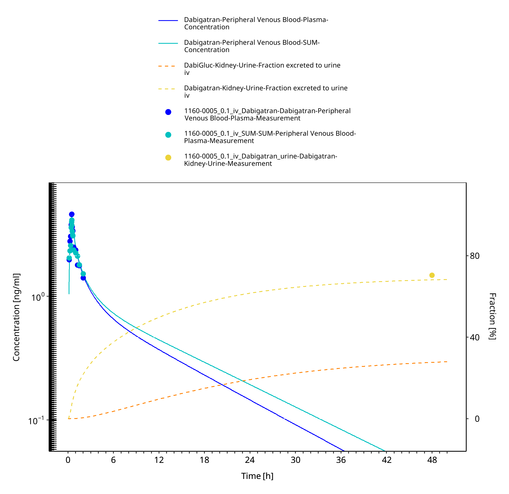
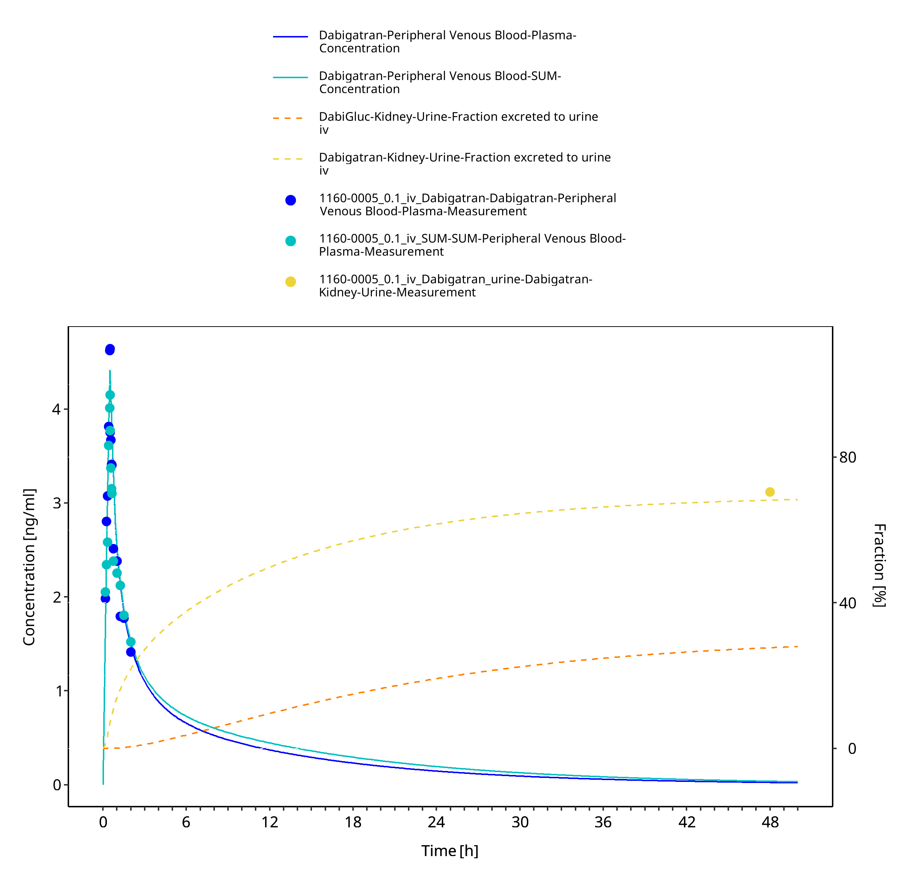
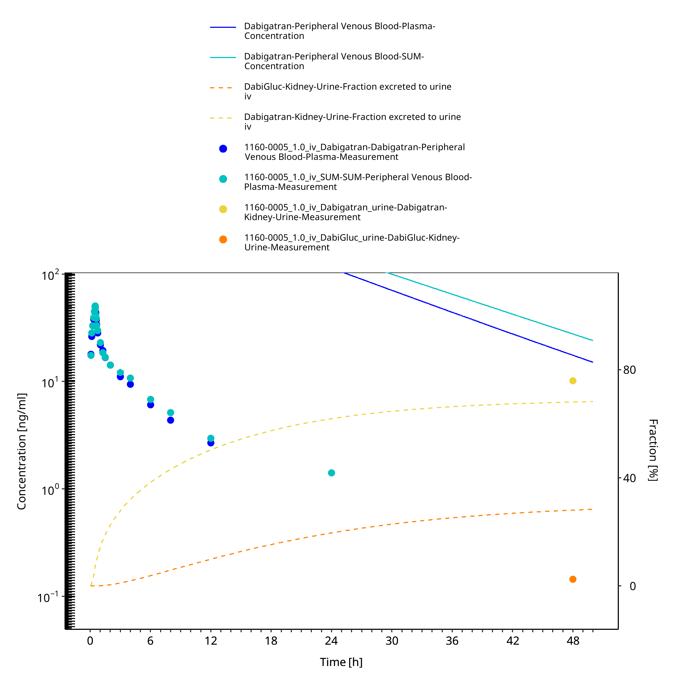
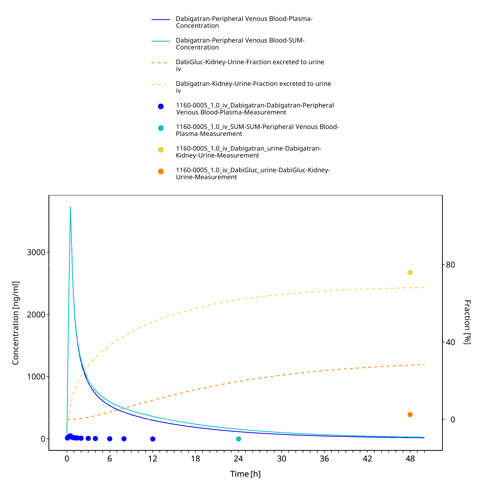
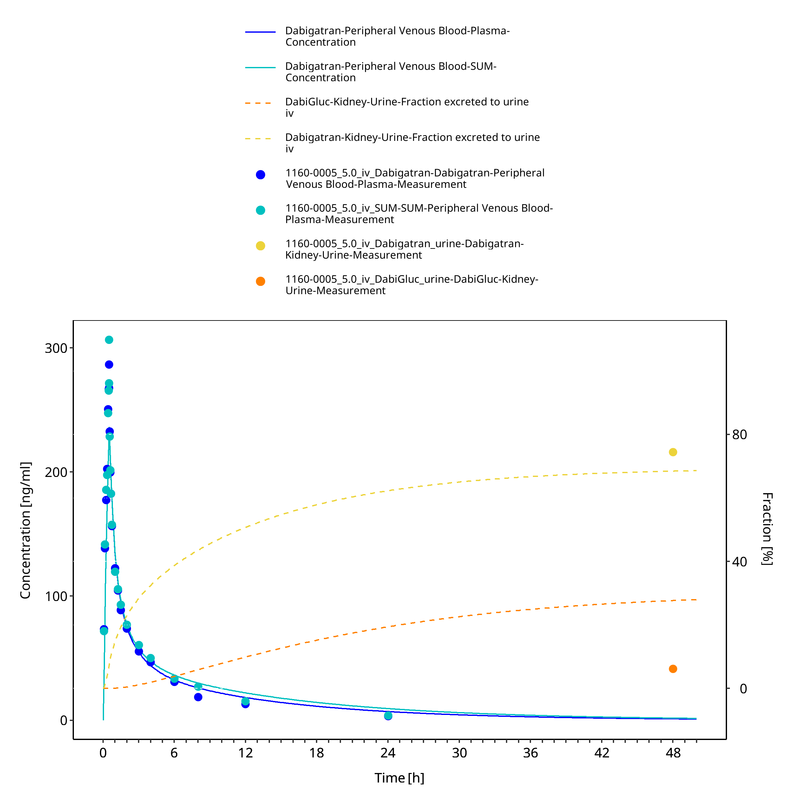

# Building and evaluation of a PBPK model for COMPOUND in healthy adults

| Version                                         | master-OSP12.2                                                   |
| ----------------------------------------------- | ------------------------------------------------------------ |
| based on *Model Snapshot* and *Evaluation Plan* | https://github.com/Open-Systems-Pharmacology/COMPOUND-Model/releases/tag/vmaster |
| OSP Version                                     | 12.2                                                          |
| Qualification Framework Version                 | 3.5                                                          |

This evaluation report and the corresponding PK-Sim project file are filed at:

https://github.com/Open-Systems-Pharmacology/OSP-PBPK-Model-Library/

# Table of Contents

 * [1 Intro](#intro)
 * [2 Methods](#methods)
   * [2.1 Strategy](#strategy)
   * [2.2 Data](#data)
   * [2.3 Assumptions](#assumptions)
 * [3 Results](#results)
   * [3.1 Parameters](#parameters)
   * [3.2 Plots](#plots)
   * [3.3 Profiles](#profiles)
     * [3.3.1 Training](#training)
     * [3.3.2 Test](#test)
 * [4 Conclusion](#conclusion)
 * [5 References](#references)

# 1 Intro

COMPOUND is an active, highly selective ... (Information about Pharmacology)

COMPOUND is ...  (Information about relevant Pharmacokinetics)

The herein presented model building and evaluation report evaluates the performance of the PBPK model for COMPOUND in (healthy) adults.

The presented COMPOUND PBPK model as well as the respective evaluation plan and evaluation report are provided open-source ([https://github.com/Open-Systems-Pharmacology/COMPOUND-Model](https://github.com/Open-Systems-Pharmacology/COMPOUND-Model)).

Alfentanil is a potent analgesic synthetic opioid. It is fast but short-acting and used for anesthesia during surgery. Alfentanil is metabolized solely by CYP3A4 (Phimmasone 2001). Like midazolam, alfentanil is not a substrate for P-gp (Wandel 2002) and less than 1% of an alfentanil dose is excreted unchanged in urine (Meuldermans 1988).

Although in clinical use alfentanil is always administered intravenously (iv), some DDI studies published plasma concentration-time profiles of alfentanil following oral ingestion. The presented alfentanil model was established using clinical PK data of 8 publications, covering iv and oral (po) administration and a dosing range from 0.015 to 0.075 mg/kg as well as absolute doses of 1 mg iv and 4 mg po. The established model is based on the model developed by Hanke et al. (Hanke 2018) and applies metabolism by CYP3A4 and glomerular filtration.

# 2 Methods

## 2.1 Strategy

## 2.2 Data

## 2.3 Assumptions

# 3 Results

## 3.1 Parameters

### Compound: Dabigatran

#### Parameters

Name                                       | Value                   | Value Origin                                                                                                                      | Alternative | Default
------------------------------------------ | ----------------------- | --------------------------------------------------------------------------------------------------------------------------------- | ----------- | -------
Solubility at reference pH                 | 17 mg/l                 |                                                                                                                                   | Measurement | True   
Reference pH                               | 7                       |                                                                                                                                   | Measurement | True   
Lipophilicity                              | 1.1436481967 Log Units  | Parameter Identification-Parameter Identification-Value updated from '#7 - iv (logP, logP, UGT, GFR)_best iv' on 2025-08-30 15:56 | Measurement | True   
Fraction unbound (plasma, reference value) | 0.65                    |                                                                                                                                   | Measurement | True   
Permeability                               | 4.6547688496E-06 dm/min | Parameter Identification-Parameter Identification-Value updated from '#1 update' on 2025-08-14 16:39                              | FIT         | False  
Is small molecule                          | Yes                     |                                                                                                                                   |             |        
Molecular weight                           | 471.51 g/mol            |                                                                                                                                   |             |        
Plasma protein binding partner             | Albumin                 |                                                                                                                                   |             |        

#### Calculation methods

Name                    | Value              
----------------------- | -------------------
Partition coefficients  | Rodgers and Rowland
Cellular permeabilities | PK-Sim Standard    

#### Processes

##### Systemic Process: Glomerular Filtration-Dabi

Species: Human

###### Parameters

Name         | Value | Value Origin
------------ | -----:| ------------:
GFR fraction |     1 |             

##### Metabolizing Enzyme: UGT2B15-FIT

Molecule: UGT2B15

Metabolite: DabiGluc

###### Parameters

Name                               | Value                      | Value Origin                                                                                                                     
---------------------------------- | -------------------------- | ---------------------------------------------------------------------------------------------------------------------------------
In vitro Vmax for liver microsomes | 0 pmol/min/mg mic. protein |                                                                                                                                  
Km                                 | 512 µmol/l                 |                                                                                                                                  
kcat                               | 4.2993761606 1/min         | Parameter Identification-Parameter Identification-Value updated from '#7 - iv (logP, logP, UGT, GFR)_best iv' on 2025-08-30 15:56

## 3.2 Plots

**Table 3-1: GMFE for Goodness of fit plot for concentration in plasma**

|Group                      |GMFE |
|:--------------------------|:----|
|Intravenous administration |5.36 |

 
 

**Figure 3-1: Goodness of fit plot for concentration in plasma**

 
 

**Figure 3-2: Goodness of fit plot for concentration in plasma**

 
 

## 3.3 Profiles

### 3.3.1 Training

**Figure 3-3: 1160-0005 - Dabigatran iv 0.1 mg - log**

 
 

**Figure 3-4: Time Profile Analysis**

 
 

**Figure 3-5: 1160-0005 - Dabigatran iv 0.1 mg - log**

 
 

**Figure 3-6: Time Profile Analysis**

 
 

**Figure 3-7: 1160-0005 - Dabigatran iv 0.1 mg - log**

 
 

**Figure 3-8: Time Profile Analysis**

 
 

### 3.3.2 Test

# 4 Conclusion

# 5 References

